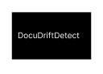

# Documentation Drift Detector



Documentation Drift Detector is a VS Code extension that finds likely gaps between
changed JavaScript or TypeScript APIs and the documentation in your workspace.

Detection runs locally and works without AI, accounts, or cloud services.

> **Beta:** The extension reports likely documentation drift. Findings should be
> reviewed before documentation is changed or released.

## Features

- Analyzes changed `.ts`, `.tsx`, `.js`, `.mjs`, and `.cjs` source files.
- Detects exported functions, arrow functions, and classes.
- Extracts function parameters, optional/default parameters, and rest parameters.
- Scans `README.md`, `docs/`, and `examples/`.
- Reports exported APIs that are missing from documentation.
- Detects documented function calls with the wrong number of arguments.
- Supports mixed JavaScript and TypeScript workspaces.
- Produces a detailed OutputChannel report and popup summary.
- Offers optional OpenAI-powered documentation update previews.
- Keeps core drift detection fully offline.

## Video Walkthroughs

### Detecting Documentation Drift

> Video walkthrough coming soon.

<!-- Replace this comment with a linked thumbnail or video URL. -->

### Generating a Documentation Update

> Video walkthrough coming soon.

<!-- Replace this comment with a linked thumbnail or video URL. -->

## Quick Start

1. Open a Git workspace in VS Code.
2. Change an exported JavaScript or TypeScript API.
3. Open the Command Palette.
4. Run `Documentation Drift: Check Workspace`.
5. Review the **Documentation Drift** OutputChannel and popup summary.

The extension analyzes changed source files reported by Git and compares their
exported APIs with references and examples in your configured documentation paths.

## Supported Languages

| Language | Extensions | Supported exports |
| --- | --- | --- |
| TypeScript | `.ts`, `.tsx` | Functions and classes |
| JavaScript | `.js`, `.mjs`, `.cjs` | Functions, async functions, arrow functions, and classes |

TypeScript declaration files (`.d.ts`) are excluded from changed-source analysis.

## Detection Example

Given this JavaScript API:

```js
export function loginUser(username, password) {
  return { username, authenticated: true };
}
```

And this outdated documentation:

```js
loginUser("alex");
```

The extension reports:

```text
Function: loginUser
Issue: Expected 2 arguments but found 1.
Example: loginUser("alex")
```

Updating the example resolves the finding:

```js
loginUser("alex", "secret");
```

## JavaScript Support

The JavaScript analyzer supports common ES module exports:

```js
export function createUser(name, email, password) {
  return { name, email, password };
}

export class UserService {}

export const deleteUser = async (id) => {
  return { deleted: true, id };
};

export default function loginUser(username, password) {
  return { username, authenticated: true };
}
```

Because JavaScript is analyzed syntactically without project type checking,
unannotated parameter and return types are represented as `unknown`.

## Example Report

```text
# Documentation Drift Report

## Changed files
- src/users.js

## Documentation files scanned
- README.md
- docs/api.md
- examples/basic.md

## Exported APIs found
- function createUser(name: unknown, email: unknown, password: unknown): unknown
- function loginUser(username: unknown, password: unknown): unknown
- function deleteUser(id: unknown): unknown
- class UserService

## Drift findings
- docs/api.md
  Function: loginUser
  Signature: loginUser(username: unknown, password: unknown): unknown
  Issue: Expected 2 arguments but found 1.
  Example: loginUser("alex")
```

## Commands

| Command | Description |
| --- | --- |
| `Documentation Drift: Check Workspace` | Analyzes changed APIs and reports likely documentation drift. |
| `Documentation Drift: Generate Documentation Update` | Generates an optional documentation update preview when AI is configured. |

## How It Works

```text
Command
  -> GitService
  -> AnalyzerFactory
     -> TypeScript Analyzer
     -> JavaScript Analyzer
  -> DocumentationScanner
  -> DriftDetector
  -> OutputChannel
  -> Popup Summary
```

The analyzer results are merged before documentation matching, so JavaScript and
TypeScript APIs can appear in the same report.

## Documentation Scanning

The default scan paths are:

- `README.md`
- `docs/`
- `examples/`

Markdown and supported example files are indexed for API references and function
calls. Missing paths are skipped safely.

## Settings

| Setting | Default | Description |
| --- | --- | --- |
| `docDrift.documentation.scanPaths` | `["README.md", "docs", "examples"]` | Workspace-relative documentation files or directories to scan. |
| `docDrift.ai.enabled` | `false` | Enables optional documentation generation. |
| `docDrift.ai.openAIApiKey` | `""` | User-provided API key used only for optional generation. |
| `docDrift.ai.openAIModel` | `gpt-4.1-mini` | Model used for optional documentation update previews. |

## Optional AI Assistance

AI is not required for detection. With AI disabled or no API key configured, the
extension continues to analyze code and detect documentation drift locally.

When enabled, generated documentation opens as a preview for review. The extension
does not silently overwrite documentation.

## Beta Limitations

The current beta focuses on local, syntax-based API analysis and documentation
matching. It may produce false positives and does not cover every JavaScript or
TypeScript export pattern.

The beta does not include:

- Authentication or billing
- Team dashboards
- Backend or cloud services
- GitHub integration
- Automatic documentation writes

## Development

Install dependencies and compile:

```sh
npm install
npm run compile
```

Press `F5` in VS Code to launch the Extension Development Host.

Run the quality checks:

```sh
npm run lint
npm run test:unit
```

Package a local beta build:

```sh
npm run package:extension
```

## License

Released under the [MIT License](LICENSE.md).
The beta does not include billing, authentication, backend services, team dashboards, GitHub integration, or cloud infrastructure.
